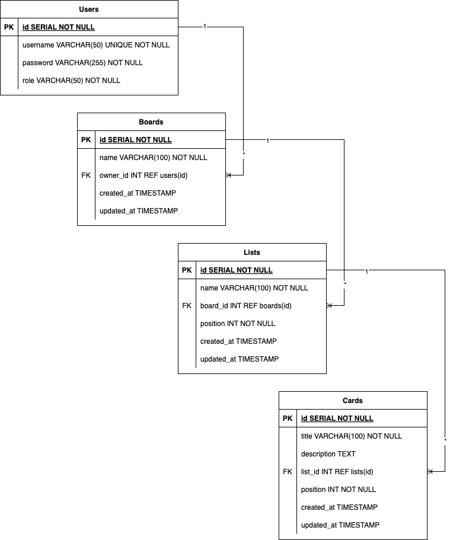

# Kanban Board REST API with Security

## Overview

The **Kanban Board REST API** is a backend service for managing tasks using a Kanban-style approach. It allows authenticated users to create, manage, and organize tasks within a board structure that includes boards, lists, and cards. The API is built with Java and Spring Boot, with secure authentication, caching, and containerization for deployment scalability and reliability. Also this project automates testing, building and pushing workflows using GitHub Actions CI/CD.

[](https://www.java.com)
[](https://spring.io/projects/spring-boot)
[](https://www.docker.com)
[](https://kubernetes.io)
[](https://redis.io)
[](https://jwt.io)
[](https://www.postgresql.org)
[](https://prometheus.io)
[](https://grafana.com)

---

## AWS Deployment

The application is deployed under this IP address:

13.48.126.153:30001/

[Click here to visit the API documentation](http://13.48.126.153:30001/)

Visiting root endpoint, doesn't need any authentication.

For the deployment k3s (lightweight kubernetes) was used.

---

## Continuous Monitoring

In this project, two Grafana dashboards have been set up:

1. One for overall monitoring of JVM metrics.
2. The other for monitoring the count of root endpoint calls.

Prometheus is used for scraping the data, and Grafana is used for visualization.

**URLs:**

- **JVM Metrics Dashboard**: [JVM Metrics Dashboard](http://13.48.126.153:30002/d/vJAZ9jwWk/jvm-micrometer-kubernetes-prometheus-by-istio?from=now-5m&to=now&timezone=browser&var-application=&var-namespace=&var-jvm_memory_pool_heap=$__all&var-jvm_memory_pool_nonheap=$__all&var-version=&refresh=5s)
- **Root Endpoint Calls Dashboard**: [Root Endpoint Calls Dashboard](http://13.48.126.153:30002/d/ae3uryimk3sowe/root-endpoint-calls?from=now-5m&to=now&timezone=browser&refresh=5s)

**Credentials:**

- Username: admin
- Password: admin

---

## Features

- **User Authentication**: Secure login either with JWT-based or basic username/password authentication.
- **Board Management**: Creation and management of boards, with support for multiple administrators.
- **List and Card Management**: Organize tasks within boards using lists and cards.
- **Role-based Access Control**: Separate permissions for administrators and users.
- **Redis Caching**: Cache commonly requested data to improve performance.
- **Scalable Deployment**: Configured for containerization and deployment on Kubernetes.
- **PostgreSQL**: Hierarchical database structure with primary and foreign keys.

---

## Project Structure

```
KanbanProject/
├── .github/
│   ├── workflows/
├── db/
│   ├── Dockerfile
│   └── init.sql
├── k8s/
│   ├── configmap.yml
│   ├── db-deployment.yml
│   ├── kanban-service-deployment.yml
│   ├── redis-deployment.yml
│   └── secrets.yml
├── kanban-service/
│   ├── Dockerfile
│   ├── pom.xml
│   ├── src/
│   └── target/
├── redis/
│   ├── Dockerfile
│   └── redis.conf
└── LICENSE
└── README.md
```

- `.github/`: CI/CD workflows setup for automated testing and deployment.
- `db/`: Database setup with Docker and initialization SQL scripts.
- `k8s/`: Kubernetes deployment manifests for the Kanban API, Redis, and database.
- `kanban-service/`: Main application code for the Kanban API.
- `redis/`: Redis configuration for caching.

---

## Installation

### Prerequisites

- Docker
- Kubernetes (Minikube)

### Steps

1. **Clone the Repository**

   ```bash
   git clone https://github.com/nzhussup/KanbanBoard.git
   cd KanbanBoard
   ```

2. **Start Kubernetes Cluster with the quickstart.sh Script**

   ```bash
   sh quickstart.sh
   ```

3. **Get kanban-service URL**
   ```bash
   minikube service kanban-service --url
   ```

---

## Usage

### Accessing the API

Once the application is running, the API is accessible at the URL minikube gave.

### Sample Requests

You can use tools like **curl** or **Postman** to test the API endpoints. Make sure to include JWT tokens for secure endpoints.

---

## API Endpoints (Sample)

The following are the main API endpoints:

### Authentication

- **POST** `/auth/login`: User login, returns a JWT token.
- **POST** `/auth/register`: New user registration.

### `/api` Endpoint

### Users

- **GET** `/users/all`: Get all users.

### Board

- **POST** `/board/add`: Create a new board.
- **GET** `/board/all`: Get all boards.
- **GET** `/board/{id}`: Get a board by ID.
- **PUT** `/board/update/{id}`: Update a board.
- **DELETE** `/board/delete/{id}`: Delete a board.

### List

- **POST** `/list/add`: Create a new list within a board.
- **GET** `/list/all`: Get all lists.
- **GET** `/list/{id}`: Get a list by ID.
- **PUT** `/list/update/{id}`: Update a list.
- **DELETE** `/list/delete/{id}`: Delete a list.

### Card

- **POST** `/card/add`: Create a new card within a list.
- **GET** `/card/all`: Get all cards
- **GET** `/card/{id}`: Get a card by ID.
- **PUT** `/card/update/{id}`: Update a card.
- **DELETE** `/card/delete/{id}`: Delete a card.

---

## API Documentation

To see the full API documentation, open the kanban-service URL in your browser then enter following credentials:

- username: nurik
- password: 1234

This will open a swagger-ui with all API endpoints available.

---

## Security

### Authentication

This API uses **JWT** (JSON Web Tokens) to secure endpoints. A valid JWT token must be included in the `Authorization` header as a **Bearer** token to access protected resources.

### Role-Based Access Control (RBAC)

- **Admin**: Can manage all boards, lists, and cards.
- **User**: Can only access boards, lists, and cards they create.

### Bcrypt Password Encoding

All user sensetive data such as passwords are encoded using **BCrypt** with the stength of 12, to ensure high level of security.

### Redis Caching

Redis caching is used to store frequently accessed data, improving response times and reducing database load.

---

## Database Model



---

## Technologies Used

- **Java & Spring Boot**: Backend API. Spring Web / Spring Security.
- **Docker**: Containerization of services.
- **Kubernetes**: For scalable deployment.
- **Redis**: Caching layer.
- **JWT**: Security for authentication.
- **BCrypt**: Password Encoding.
- **PostgreSQL**: Database for data persistence.

---

## Contact

For questions or collaboration, please contact [zhussup.nb@gmail.com](mailto:zhussup.nb@gmail.com).

LinkedIn: [Nurzhanat Zhussup](https://www.linkedin.com/in/nurzhanat-zhussup/).
